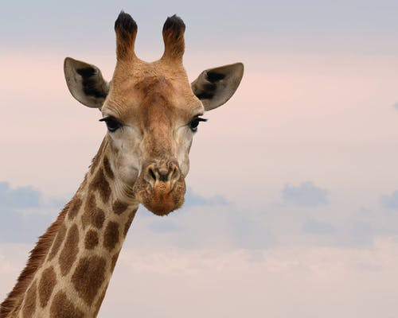

```{r setup, include=FALSE}
knitr::opts_chunk$set(echo = FALSE)
```

## Background

- I was born in Yankton, South Dakota on February 11, 1998
- I am admitted in the Statistics program here at the University of Nebraska Lincoln
- I expect to graduate in the spring of 2022!

## My favorite animal

{#id .class width=50% height=50%}


## My favorite Plot

```{r plot, message=FALSE}
library(mclust)
library(ggplot2)
ggplot(data = banknote) + geom_histogram(aes(y = Bottom, fill = Status), bins = 20) + coord_flip()
```

## Link to CV
Follow The below link to view my CV!
[Jayden CV](JaydenCV.pdf)

